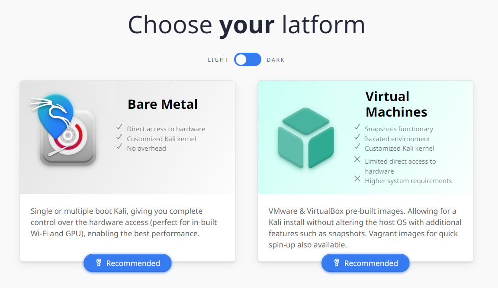
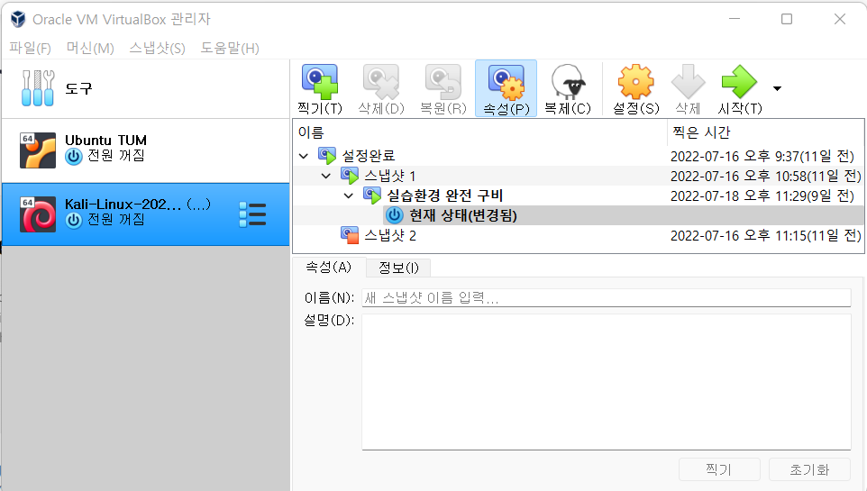
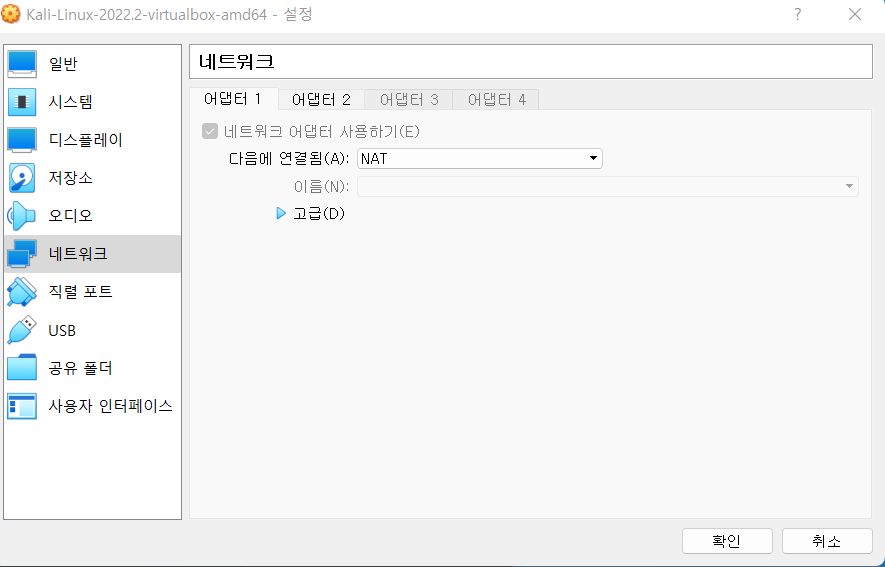
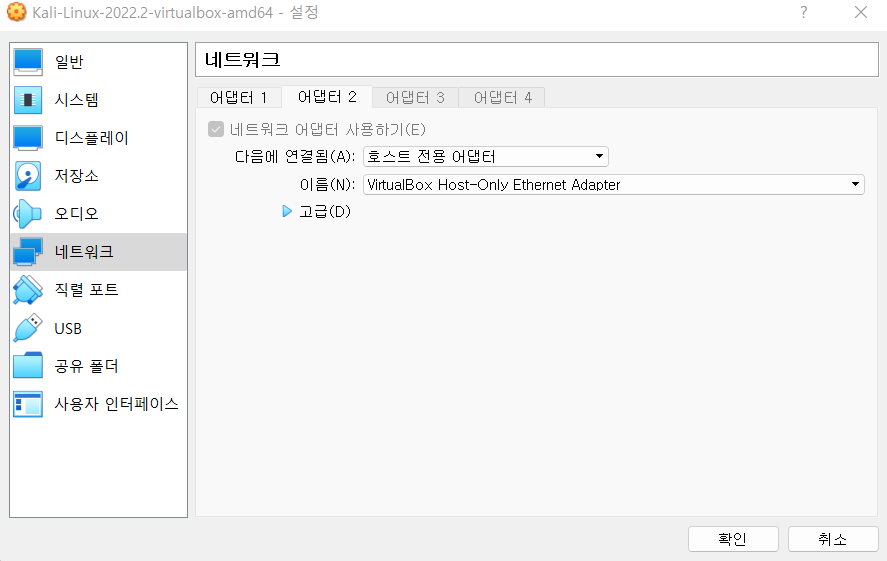

### 0. 시작하기에 앞서

나는 (적어도 아직은) 이 분야의 비전공자다. 따라서 22년도의 C-Sec 관련 글들은
"Tool Kido" 이상의 의미를 가지기 어렵다. 즉, 단순히 해킹의 기법들을 이해하고 또 툴들로 이들을 간단히 재현해보는 것에
초첨을 맞춘다. 해킹 실습을 위해선 Pentest Gym의 예제들을 활용하였다. 물론 기초지식들은 천천히 닦아나갈 예정이다.

### 1. 칼리 리눅스 Virtual Box 버전 다운로드

#### 칼리 리눅스란?

칼리 리눅스는 웹 해킹에 특화된 OS로, 설치만 해도 Pen Test나 기타 해킹용 분석에 필요한 도구들을
패키지로 제공한다. 물론 각 툴들은 

#### Virtual Box란?

기본적으로 운영체제는 PC당 한개, 또는 듀얼부팅으로 두 개 정도를 설치하는게 보통이다. 하지만
처음부터 Kali나 Ubuntu등을 아예 설치해버리기에는 (심적으로) 부담이... 있다. Virtual Box는 
Oracle 사에서 제공하는 OS 구동 툴로써, OS설치파일을 다운받은 후 Virtual Box 위에서 Open하면...?

**무려!** 바로 운영체제를 실행해 볼 수 있다. 물론 RAM이나 SSD 용량같은것도 어느정도 할당해 줄것인지 설정이 가능하다.

내 노트북의 램은 16기가이므로, Virtual Box의 Kali Linux에는 4기가의 램을 할당하고, SSD용량은 따로 프로그램을 설치할 것이 아니므로
그냥 100기가정도만 할당했다. 아래부터는 그림과 함께 설치 과정을 진행해보자!

(Virtual Box 설치는 되어있다고 가정한다.)

1. 칼리 리눅스 홈페이지 접속 후 가상 시스템 파일 다운로드



여기서 Virtual Box 버전을 클릭해 다운받으면 된다.

Virtual Box의 파일(F) -> 가상 시스템 가져오기 클릭



2. Virtual Box 실행 후 가상 시스템 설치
 
Virtual Box의 파일(F) -> 가상 시스템 가져오기 클릭

2. 두 개의 네트워크 어댑터 설정



아마 기본적으로 NAT 어댑터 하나만 설정이 되어있을 것이다. 이것은 외부 망으로, 다른 시스템들과 같이 공유하는 네트워크 어뎁터다.
우리는 추가적으로 두 번째 네트워크 어댑터를 설정하여 Kali에서만 이용하는 로컬 사설 망을 하나 만들어줄 것이다.



아마 이게 설치중에서 그나마 제일 복잡한 내용 아닌가 싶다...

4. Virtual Box에서 Kali Linux 더블클릭 후 실행


여기까지만 하면 뒤에는 칼리 리눅스의 설치가 자동으로 완료되고, 로그인 창이 뜬다. 여기서 놀라지 말고, 모든 kali linux의 초기 유저/비밀번호인
kali/kali를 입력해주면 성공적으로 로그인이 완료되게 된다. 그럼 이어서 초기 설정과 kali linux의 대표 툴들을 알아보겠다.

### 2. 초기 설정

Kali Linux는 (적어도 간단한 실습 단계에선) 많은 초기 설정을 필요로 하지 않았다. 하지만 난 다음과 같은 설정들을 변경했다.

1. interfaces 변경 (네트워크 어댑터 설정)

다음을 콘솔에 입력해 interfaces 파일을 열고 파일 내용을 바꿔준다.

```
//콘솔 입력
sudo editor /etc/network/interfaces

//파일 내용 아래와 같이 변경
# This file describes the network interfaces available on your system
# and how to activate them. For more information, see interfaces(5).

source /etc/network/interfaces.d/*

# The loopback network interface
auto lo
iface lo inet loopback

auto eth0
iface eth0 inet dhcp

auto eth1
iface eth1 inet dhcp

// Network Restart
sudo systemctl restart networking

```

여기까지 하고 인터넷에 접속해서 네이버에 들어가진다면 일단 외부망(NAT)은 잘 설정된것이다.

2. Kali Repository 확인/변경

앞으로 리눅스 패키지를 다운로드 받을 때 사용할 Repository를 설정해준다. 기본설정이 되어있지만, 적어도 나는(...) 기본설정이 더이상 지원하지 않는
Repo였어서 한참 헤맸다...

```
//다음을 콘솔에 입력
editor /etc/apt/sources.list

//내용을 다음과 같이 변경
deb http://http.kali.org/kali kali-rolling main contrib non-free
//이 줄 외에는 전부 주석처리 하시면 됩니다 :)
```
3. (나에겐)필수 패키지 설치

- gedit (windows 메모장같은 에디터 설치)
- 한글 폰트 (당연히 필수)
- FoxyProxy : FireFox Extension (추후에 많이 사용합니다.)

```
sudo apt-get install gedit
sudo apt-get install -y fonts-nanum
```

4. FoxyProxy 및 Proxy 설정

우리가 어떠한 요청을 보낼 때 Proxy의 IP주소를 통과해 보내고 요청을 받도록 할 수 있다. 하지만 이를 FoxyProxy 없이 하려면 계속 설정 창에 들어가서
Proxy를 껐다 켰다 하는 수고스러움을 감당해야한다. FoxyProxy는 이를 원터치로 해결할 수 있게 해주는 아주 편리한 Extension이다.

*(!)SQL Injection 등의 공격을 할 때 물론 일일히 수기로 (...) 입력해도 되지만, Burp Suite 등의 툴을 활용할 수 있다. 하지만 Burp Suite를 
localhost등의 개인 앱이 아닌 실제 웹 애플리케이션 대상으로 사용할 때는 대부분 이를 감지해 Warning 창이 뜨게 되므로, 약간의 설정이 필요하다.

글이 너무 길어지니, FoxyProxy 설정에 관한 글을 따로 작성하였다.

[FoxyProxy 설정 관련 포스트](<https://hosahn.github.io/220719_2>)

단, Community Edition을 활용하는 경우에는 Temporary Project 외에는 생성 할 수 없으므로 절대로 Burp Suite를 종료하지 말자... 종료한다면 위의 과정 *(!)의 과정을 다시 반복하면 된다. 약간은 수고스럽지만 그렇다고 계속 Warning 창을 보는 것 보단 낫다고 생각한다.

여기까지만 하면 적어도 내가 한 세팅은 완료이다. 다음 포스트부터는 Step By Step으로 Pentest Gym에 있는 모든 교육과정들을 밟아나갈 예정이다!

---

## Source

- [Kali Linux](<https://www.acmicpc.net/problem/4963>)
- [Virtual Box, Powered by Oracle](<https://www.acmicpc.net/problem/4963>)
- [xampp](<https://www.acmicpc.net/problem/4963>)

