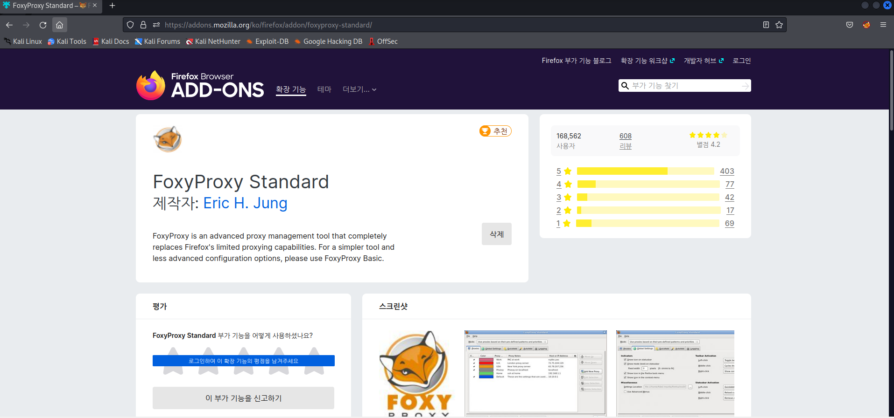
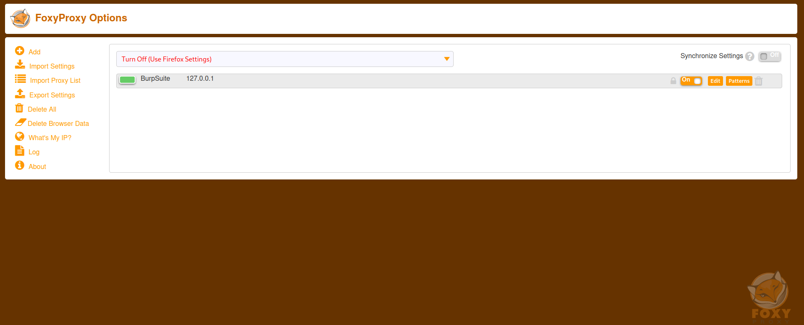
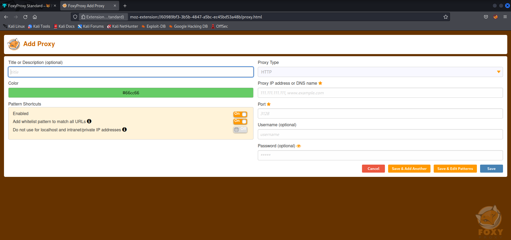
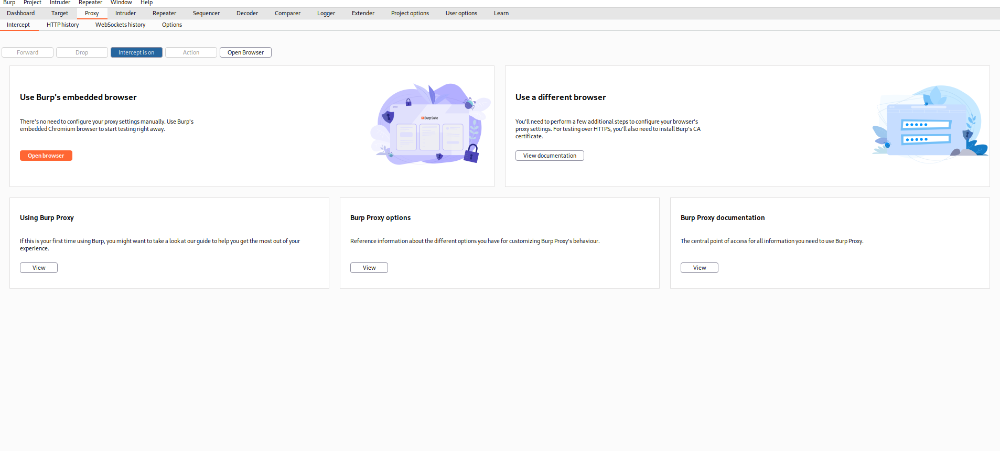
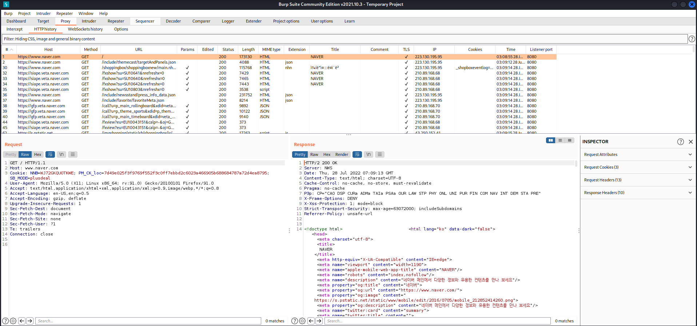
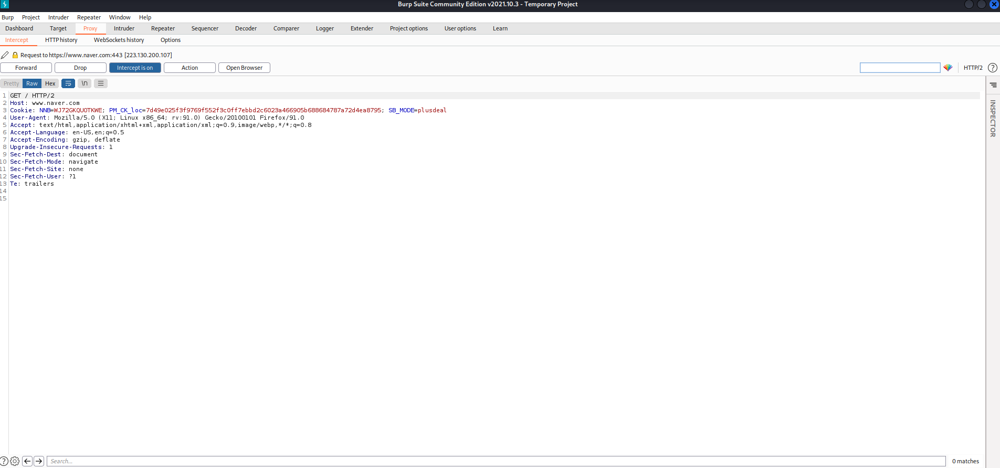

### 1. Foxy Proxy란?

웹 브라우저 ↔ 웹 프록시 ↔ 웹 서버 간 원활한 통신을 위해 사용할 FireFox의 Extension이다.
왜 하필 웹 브라우저로 FireFox를 사용하냐? 라고 묻는다면, Kali에서 기본적으로 제공하는게 FireFox라 그렇다(...)

일반적으론 웹 브라우저 ↔ 웹 서버의 통신이 이루어지지만 우린 해킹을 실습하므로 대부분의 요청이 우리가 설정한 프록시를 거쳐서 와야한다.
이 프록시로 요청이 통과하며 추후에 실습할 Intercept라던지, 추가적인 작업이 이뤄지기 때문이다. 프록시 설정은 사실 FoxyProxy를 사용하지 않아도
가능하다. Settings -> Security -> Proxy로 가서 설정 가능하지만, 여기서 설정하면 Proxy를 껐다 켰다 할때마다 일일히 Settings에 가서 설정해야하므로 아주아주 귀찮을 수 있다. 이걸 원버튼으로 이용하기 위해 FoxyProxy를 이용한다.

### 2. Foxy Proxy 다운 및 기초 설정 With Burp Suite

일단 확장기능 추가부터 해보자

[FoxyProxy 링크](<https://addons.mozilla.org/ko/firefox/addon/foxyproxy-standard/>)

그 다음으로 FoxyProxy에 새로운 Proxy 설정을 추가해보자. 아마 extension 추가 후 새로고침을 누르면 좌측 상단에 FoxyProxy 아이콘이 추가되었을것이다. 아이콘을 누르고 Options를 클릭하자.

그럼 이런 창이 뜬다. (Burp Suite는 제가 미리 추가해놓은 Proxy로, 초기엔 없습니다!) Add를 눌러보자.

- title : 원하는대로
- Proxy IP Address : Burp Suite Proxy에 설정한 대로 (따로 설정한 적 없다면 127.0.0.1로 되어있을 것이다. 그냥 127.0.0.1 쓰면 된다.)
- Port : 동일하다, 기본은 8080이다.
- Username, Password 필요없음

여기까지 입력하고 Save하자! 다시 브라우저에서 FoxyProxy 아이콘을 클릭해보면 새로운 프록시 옵션이 보일것이다. 누르면 Proxy옵션을 켤 수 있다.

### 3. Burp Suite 설정 및 Warning 없애기 

이제 Burp Suite로 테스트해보자. 일단 FoxyProxy에서 설정을 켜고, Burp Suite를 실행해준다. 우리가 FoxyProxy에서 설정한 Proxy 주소랑 Burp Suite에서 사용하는 Proxy 주소가 일치하는지 꼭 확인하자.

이제 브라우저에서 아무 사이트나 들어가보자. naver.com을 들어간 후 Burp Suite의 HTTP History를 봐보면

이런식으로, 내가 보낸 모든 요청들이 잘 정리되어있는것을 볼 수 있다. 심지어 네이버나 구글에 로그인하면 내 로그인 정보와 기기까지 전부 (...) 보인다.

이제 마지막으로 Intercept를 On 해보자.

그렇게 되면 브라우저는 계속 로딩 상태가 되고, Burp Suite에는 내가 보낸 요청과 응답이 나타난다.
Intercept가 뭔지 모른다면, 영어 단어 뜻 그대로, 내가 보낸 HTTP 요청을 Burp Suite가 가로채간다는 뜻이다. Intercept를 On 하면 그 요청이 Burp Suite에게 빼앗겨버리므로, 브라우저에서는 무한로딩이 된다.

### 4. 만약 Warning이 뜬다면

아마 Proxy 설정을 켜고 NAVER에 접속했는데, Warning이 뜨면서 바로 접속이 안되고 더보기에서 <위험을 감수하고 진행> 버튼을 클릭해야만 사이트에
접속되는 경우가 있을것이다. 이건 자동적으로 서버에서 우리의 요청이 Proxy로 Redirect 되는것을 감지해서 일어나는 일이다. 당연히 보안상 문제가 있을 수 있기에 유저에게 경고하는것이다. 이걸 무시하기 위해선 Burp Suite에서 제공하는 DER Certificate을 업로드 해줘야한다. 어렵지는 않으나 DER 등의 인증서에 관한 지식은 알아두면 좋을 것 같으므로, 이에 대해선 따로 포스트로 다뤄보기로 하겠다.

---

## Source

- [Burp Suite](<https://www.acmicpc.net/problem/4963>)

